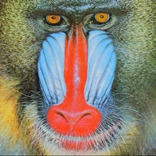
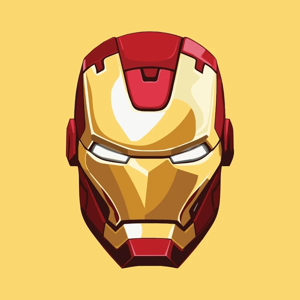

# LegoNarto-Da-Vinci

A Python project for creative Lego-inspired art generation.

## Features

- Convert your jpg pictures into Lego art work
- Customizable color palettes (see [Lego colors](https://super-briques.fr/fr/15898-tuile-ronde-1x1-piece-lego-98138-19415.html#/2433-couleur-rouge_red))
- Customizable size / scale

## Installation

```bash
git clone git@github.com:Sauterelle57/LegoNarto-Da-Vinci.git
cd legoNarto-Da-Vinci
pip install -r requirements.txt
```

## Usage

```bash
python main.py --input your_image.jpg --output result.png
```

## Examples

Here are some example outputs generated by **LegoNarto-Da-Vinci**:

<p>
    
    
    
</p>

<p>
    
    
    
</p>

<p>
    
    
    
</p>

## Contributing

Pull requests are welcome. For major changes, please open an issue first.

## License

[MIT](LICENSE)
