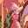
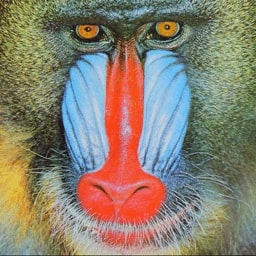
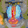
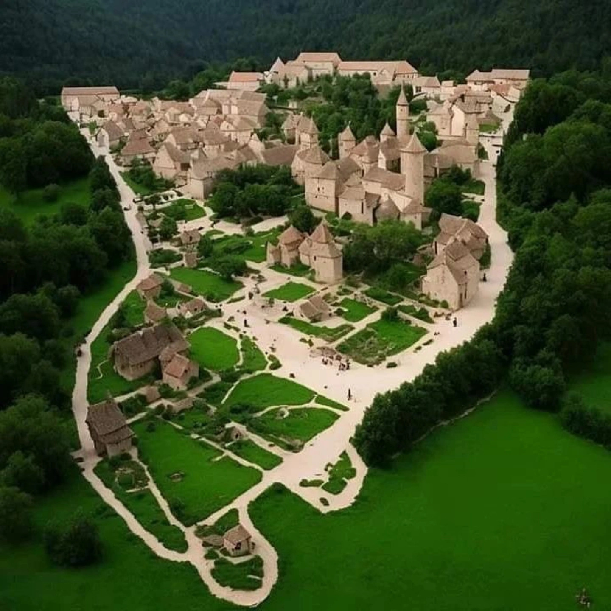
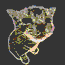
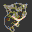

# LegoNarto-Da-Vinci

LegoNarto-Da-Vinci is a Python-based image processing tool that transforms regular photographs into Lego-style pixelated artwork. The project converts input images by:

- `Color Mapping`: Analyzing each pixel and mapping it to the closest available Lego color from a predefined palette (stored in colors.txt)
- `Downsampling`: Resizing images to create a pixelated, blocky appearance typical of Lego mosaics
- `Artistic Conversion`: Generating output images that simulate what the original photo would look like if built with actual Lego bricks

The project includes [examples](#examples) conversions of various subjects (portraits, animals, characters) demonstrating the effectiveness of the algorithm in creating recognizable Lego-style artwork from photographs. This tool could be particularly useful for Lego enthusiasts looking to create custom mosaics or artists interested in pixel art generation.

## Features

- Supports common image formats (JPG, PNG)
- Customizable output dimensions (32x32, 64x64, etc.)
- Uses authentic Lego color palette for realistic results (see [Lego colors](https://super-briques.fr/fr/15898-tuile-ronde-1x1-piece-lego-98138-19415.html#/2433-couleur-rouge_red))
- Command-line interface for easy batch processing
- Produces high-quality pixelated art suitable for Lego building instructions

## Installation

```bash
git clone git@github.com:Sauterelle57/LegoNarto-Da-Vinci.git
cd legoNarto-Da-Vinci
pip install -r requirements.txt
```

## Usage

```bash
python src/main.py
```

```bash
Enter image path: sources/bears.jpg
Enter result path: (default: ./results/result.png) results/bears_64.png
Enter result size (default: 32x32): 64x64
Processing...
Generating the result...
Image successfully saved to 'results/bears_64.png'.
Processing completed in 39.27 seconds.
```

## Color Customization

To customize the color palette, edit the `colors.txt` file located in the `./resources` folder. Each line should specify a Lego color using its RGB values. You can add, remove, or modify colors to match your preferences or specific Lego brick availability. The tool will automatically use your updated palette for color mapping during image conversion.

**Warning:**
When editing `colors.txt`, ensure each line follows the correct format:

```py
R G B #hexa (Name)
```

> `R G B` (e.g., **211 10 11** for lego red).<br> `#hexa` (e.g., **#d30a0b** for lego red)<br> `Name` (e.g., **(Red)** for lego red)<br>
> /!\ Incorrect formatting may cause errors or unexpected results during image conversion. /!\

## Examples

Here are some example outputs generated by **LegoNarto-Da-Vinci**:

<p>
    
    
    
</p>

<p>
    
    
    
</p>

<p>
    
    
    
</p>

<p>
    
    
    
</p>

## Contributing

Pull requests are welcome. For major changes, please open an issue first.

## License

[MIT](LICENSE)
